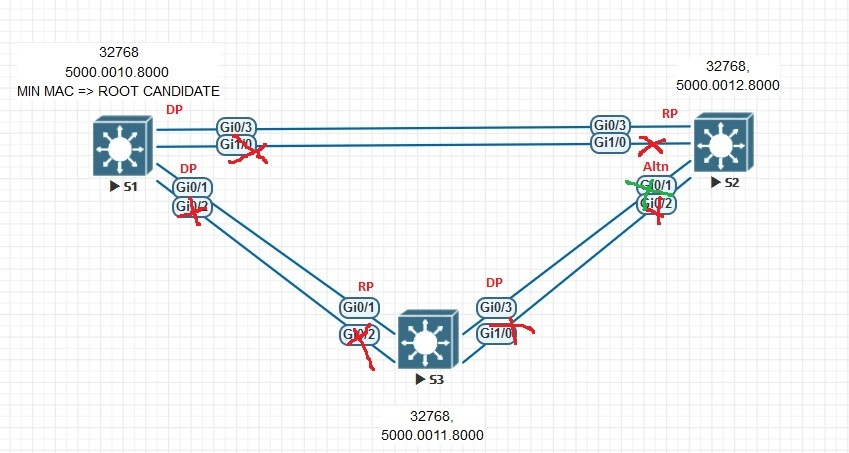
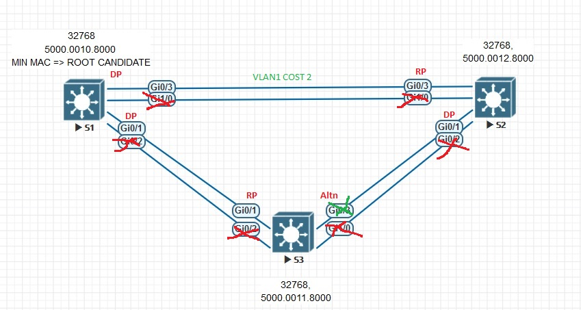

# Развертывание коммутируемой сети с резервными каналами

###  Задание:
1. Создание сети, настройка основных параметров устройств
2. Выбор корневого моста
3. Наблюдение за процессом выбора протокола STP порта, исходя из стоимости портов
4. Наблюдение за процессом выбора протокола STP порта, исходя из приоритета

###  Решение:
1. Графическая схема до начал работы, с нанесенной информацией о текущем приоритете и MAC-адресе коммутатора

### Просмотр приоритета и MAC адреса свича
```
show lacp sys-id 
```
Базовые настройки коммутаторов c настроенными транковыми портами [S1](config/S1), [S2](config/S2), [S3](config/S3).

2. Выбор ROOT 
Состояние STP после отключения избыточных интерфейсов Gi0/0, Gi0/2
### Просмотр состояния STP S1
```
S1#show spanning-tree
```
Из вывода команды, видно, что по-умолчанию включен протокол PVST+, S1 является ROOT для обоих VLAN, приоритет не менялся, стоимость портов не менялась, все порты в состоянии DESIGNATED, что характерно для ROOT коммутатора. 
```
VLAN0001
  Spanning tree enabled protocol ieee
  Root ID    Priority    32769
             Address     5000.0010.0000
             This bridge is the root
             Hello Time   2 sec  Max Age 20 sec  Forward Delay 15 sec

  Bridge ID  Priority    32769  (priority 32768 sys-id-ext 1)
             Address     5000.0010.0000
             Hello Time   2 sec  Max Age 20 sec  Forward Delay 15 sec
             Aging Time  300 sec

Interface           Role Sts Cost      Prio.Nbr Type
------------------- ---- --- --------- -------- --------------------------------
Gi0/1               Desg FWD 4         128.2    P2p 
Gi0/3               Desg FWD 4         128.4    P2p 


          
VLAN0100
  Spanning tree enabled protocol ieee
  Root ID    Priority    32868
             Address     5000.0010.0000
             This bridge is the root
             Hello Time   2 sec  Max Age 20 sec  Forward Delay 15 sec

  Bridge ID  Priority    32868  (priority 32768 sys-id-ext 100)
             Address     5000.0010.0000
             Hello Time   2 sec  Max Age 20 sec  Forward Delay 15 sec
             Aging Time  300 sec

Interface           Role Sts Cost      Prio.Nbr Type
------------------- ---- --- --------- -------- --------------------------------
Gi0/1               Desg FWD 4         128.2    P2p 
Gi0/3               Desg FWD 4         128.4    P2p 
```
### Просмотр состояния STP S2, S3
Из вывода видно что 
S2: порт Gi0/3 является RP (состояние FWD) за оба VLAN, порт Gi0/3 - Altn (состояние BLOCKED).
S3: порт Gi0/1 является RP (состояние FWD) за оба VLAN, порт Gi0/3 - DP (состояние FWD).

```
S2#show spanning-tree
VLAN0001
Interface           Role Sts Cost      Prio.Nbr Type
------------------- ---- --- --------- -------- --------------------------------
Gi0/1               Altn BLK 4         128.2    P2p 
Gi0/3               Root FWD 4         128.4    P2p 
          
VLAN0100
Interface           Role Sts Cost      Prio.Nbr Type
------------------- ---- --- --------- -------- --------------------------------
Gi0/1               Altn BLK 4         128.2    P2p 
Gi0/3               Root FWD 4         128.4    P2p 


S3#show spanning-tree 
VLAN0001
Interface           Role Sts Cost      Prio.Nbr Type
------------------- ---- --- --------- -------- --------------------------------
Gi0/1               Root FWD 4         128.2    P2p 
Gi0/3               Desg FWD 4         128.4    P2p 
          
VLAN0100
Interface           Role Sts Cost      Prio.Nbr Type
------------------- ---- --- --------- -------- --------------------------------
Gi0/1               Root FWD 4         128.2    P2p 
Gi0/3               Desg FWD 4         128.4    P2p 

```
Вторая часть задания состоит из отключения избыточных связей между коммутаторами и изменение стоимости одного из линков. Иллюстрация к второй части задания представлена ниже. 


### Ответы на вопросы Л/р:
- Root - S1
- S1 - ROOT, так как у него минимальный MAC-адрес и минимальный Priority Vector
- RP: S2 - Gi0/3; S3 - Gi0/1
- DP: S1 - все порты (по природе ROOT бриджа); S3 - Gi0/3
- ALTN: S3 - Gi0/1 (порт был заблокирован, так как BPDU от S3 - superior по BID)

3. Изменение стоимости порта
Изменена стоимость порта Gi0/3 на S2. Включив debug span event, мы видим следующие результаты:
```
### S2
S2(config-if)#spanning-tree vlan 1 cost 2   
*Jul 16 13:20:50.715: STP: VLAN0001 Gi0/1 -> listening
*Jul 16 13:21:05.715: STP: VLAN0001 Gi0/1 -> learning
*Jul 16 13:21:20.715: STP[1]: Generating TC trap for port GigabitEthernet0/1
*Jul 16 13:21:20.716: STP: VLAN0001 sent Topology Change Notice on Gi0/3
*Jul 16 13:21:20.717: STP: VLAN0001 Gi0/1 -> forwarding

### S1
*Jul 16 13:20:52.385: STP: VLAN0001 Topology Change rcvd on Gi0/1
*Jul 16 13:21:22.288: STP: VLAN0001 Topology Change rcvd on Gi0/3

### S3
*Jul 16 13:20:49.516: STP: VLAN0001 sent Topology Change Notice on Gi0/1
*Jul 16 13:20:49.516: STP[1]: Generating TC trap for port GigabitEthernet0/3
*Jul 16 13:20:49.517: STP: VLAN0001 Gi0/3 -> blocking
```
Из дебага можно понять, что после смены стоимости линка S2-S1, порт S2 - Gi0/1 перешел последовательно в состояния listening -> learning. Затем S2 отправил TCN для VLAN1 на порты Gi0/1, Gi0/3 - в стороны S3 и S1 - соответственно.
S1 проверил пришедшую BPDU и, не найдя в ней нового BID, не стал перерасчитывать топологию.
S3 проверил пришедшую BPDU, произвел ответную и, увидев изменившуюся стоимость Root Path Cost (уменьшился вектор приоритета за счет изменения стоимости S2-S1), принял решение произвести блокировку своего порта Gi0/3.
S2 в этот момент времени получив BPDU от S3 понял что она проигрывает BPDU, которую производит он сам и переводит порт в состояние DP

Иллюстрация к изменившейся топологии приведена ниже:

Ответом на вопрос Шаг 3 задания я вляется то, что S3 сравнивает пришедшую от S2 BPDU с информацией которая есть на нем и признает, что BPDU от S2 является лучшей. Значит надо заблокировать порт.

4. После удаления стоимости порта, видим обратную картину, порты вернулись в предварительное состояние
```
S2(config-if)#do sho span | in VLAN|Interf|Gi
VLAN0001
Interface           Role Sts Cost      Prio.Nbr Type
Gi0/1               Altn BLK 4         128.2    P2p 
Gi0/3               Root FWD 4         128.4    P2p 

VLAN0100
Interface           Role Sts Cost      Prio.Nbr Type
Gi0/1               Altn BLK 4         128.2    P2p 
Gi0/3               Root FWD 4         128.4    P2p 
```
дебаг процесса представлен ниже
```
S2
*Jul 16 16:52:05.624: STP: VLAN0001 sent Topology Change Notice on Gi0/3
*Jul 16 16:52:05.625: STP[1]: Generating TC trap for port GigabitEthernet0/1
*Jul 16 16:52:05.625: STP: VLAN0001 Gi0/1 -> blocking

S3#
*Jul 16 16:52:00.032: STP: VLAN0001 Gi0/3 -> listening
*Jul 16 16:52:15.032: STP: VLAN0001 Gi0/3 -> learning
*Jul 16 16:52:30.032: STP[1]: Generating TC trap for port GigabitEthernet0/3
*Jul 16 16:52:30.033: STP: VLAN0001 sent Topology Change Notice on Gi0/1
*Jul 16 16:52:30.033: STP: VLAN0001 Gi0/3 -> forwarding

S1#
*Jul 16 16:52:06.049: STP: VLAN0001 Topology Change rcvd on Gi0/3
*Jul 16 16:52:35.122: STP: VLAN0001 Topology Change rcvd on Gi0/1
```

5. Включим все порты на S1, S2, S3. После прохождения 30 секунд топология будет соответствовать иллюстрации

Ответы на вопросы:
- На каждом не корневом SW, RP выбран порт соединенный с портом, облажающим минимальным SenderPortID. При прочих равных условиях BPDU оценивается именно по этому параметру.
