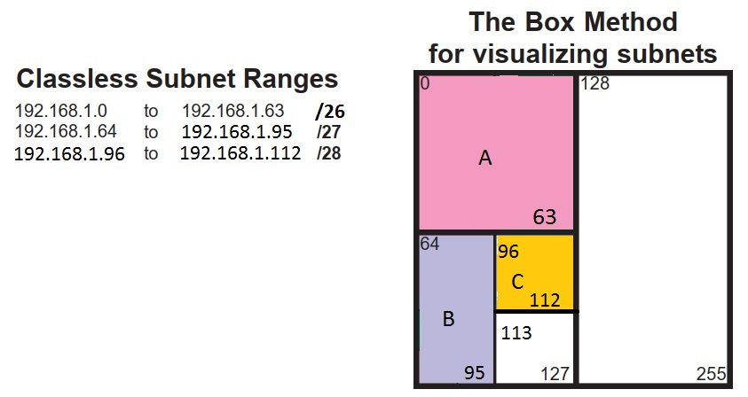
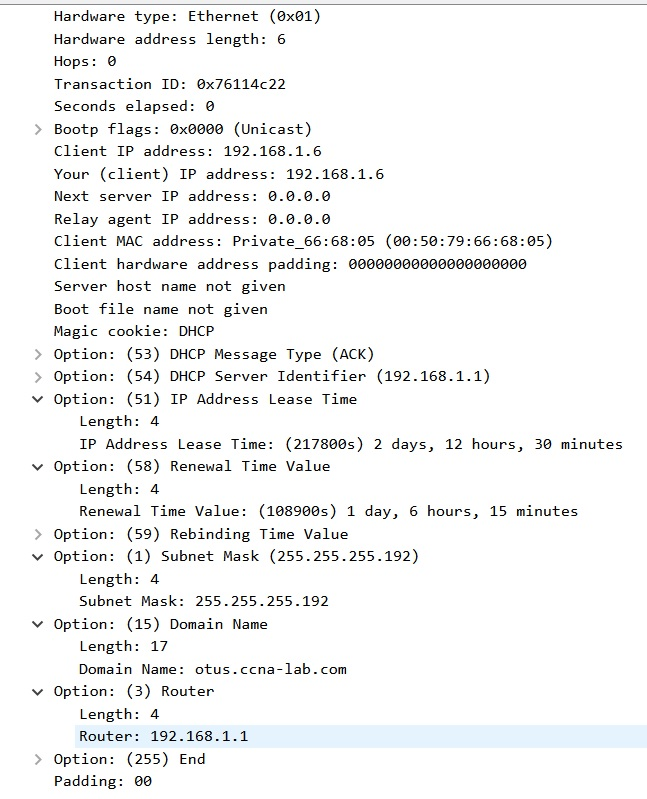

# Развертывание DHCPv4

###  Задание:
1. Построить сеть и произвести базовые настройки оборудования
2. Сконфигурировать DHCPv4 сервера для подсетей на R1
3. Сконфигурировать и проверить функционал DHCP relay на R2

###  Решение:
Графическая схема до начал работы, с нанесенной информацией о ионетфейсах и настраиваемых VLAN


### Этапы работы п.п.1
Для расчета адресного пространства используем метод квадрата, которые дает наглядность используепмых адресов 


Таблица назначения адресов, согласно ТЗ, представлена ниже:

| Device  | Interface  | IP Address     | Subnet Mask       | def GW   | Description   |
|---------|------------|----------------|-------------------|----------|---------------|
| R1      | Gi0/0      | 10.0.0.1       | 255.255.255.252   | 10.0.0.2 | IF to R2      |
|         | Gi0/1      | N/A            | N/A               | N/A      |               |
|         | Gi0/1.100  | 192.168.1.1    | 255.255.255.192   |          | VLAN100       |
|         | Gi0/1.200  | 192.168.1.65   | 255.255.255.224   |          | VLAN200       |
|         | Gi0/1.1000 | N/A            | N/A               |          | VLAN1000      |
| R2      | Gi0/0      | 10.0.0.2       | 255.255.255.252   | 10.0.0.2 | IF to R1      |
|         | Gi0/1      | 192.168.1.97   | 255.255.255.240   |          |               |
| S1      | VLAN100    | 192.168.1.2    | 255.255.255.192   |          | IF to R2      |
|         | VLAN200    | 192.168.1.66   | 255.255.255.224   |          | PC1           |
| S2      | VLAN1      | 192.168.1.98   | 255.255.255.240   |          | PC2           |
| PC1     | NIC        | DHCP           | DHCP              | DHCP     | SUBNETA       |
| PC2     | NIC        | DHCP           | DHCP              | DHCP     | SUBNETC       |

Произведем настройку оборудования.
1.1 Базовые настройки выполнены согласно ТЗ: вклчюен пароль на доступ к консоли и на переход в конфигурационный режим
1.2 Пароли локального пользователя зашифрованы
1.3 Создан баннер с предупреждением
1.4 Установлен часовой пояс MSK +3
1.5 Инициализированы необходимые vlan на S1, S2 (таблица [S1_vlan.dat](config/S1_vlan.dat))
1.6 SUBIF, IF и SVI настроены согласно таблицы интерфейсов, просмотр сконфигурированных интерфейсов выполняем командой:
```
show ip int br
```
```
S1(config)#do sho ip int br
Interface              IP-Address      OK? Method Status                Protocol
GigabitEthernet0/0     unassigned      YES unset  up                    up      
GigabitEthernet0/1     unassigned      YES unset  administratively down down    
...
GigabitEthernet1/3     unassigned      YES unset  administratively down down    
Vlan100                192.168.1.2     YES manual up                    up      
Vlan200                192.168.1.66    YES manual up                    up      

R1(config-subif)#do sho ip int br
Interface                  IP-Address      OK? Method Status                Protocol
GigabitEthernet0/0         10.0.0.1        YES manual up                    up      
GigabitEthernet0/1         unassigned      YES unset  up                    up      
GigabitEthernet0/1.100     192.168.1.1     YES manual up                    up      
GigabitEthernet0/1.200     192.168.1.65    YES manual up                    up      
GigabitEthernet0/1.1000    unassigned      YES unset  up                    up      
GigabitEthernet0/2         unassigned      YES unset  administratively down down    
...

S2(config)#do sho ip int br
Interface              IP-Address      OK? Method Status                Protocol
GigabitEthernet0/0     unassigned      YES unset  up                    up      
GigabitEthernet0/1     unassigned      YES unset  administratively down down    
...
GigabitEthernet1/3     unassigned      YES unset  administratively down down    
Vlan1                  192.168.1.98    YES manual up                    up      

R2(config-if)#do sho ip int br
Interface                  IP-Address      OK? Method Status                Protocol
GigabitEthernet0/0         10.0.0.2        YES manual up                    up      
GigabitEthernet0/1         192.168.1.97    YES manual up                    up      
GigabitEthernet0/2         unassigned      YES unset  administratively down down    
```

Из вывода видно, что настроенные интерфейсы в состоянии up/up, что объясняется выполнение команды no shut на интерфейсах и существованием необходимых VLAN на S1.
1.8 Неиспользуемые интерфейсы принудительно выключены командой shutdown, что отражается статусом administratively down/down
Настройка интерфейсов на S1, S2 выполнялась с использованием команлды range, что существенно ускоряет настройку.
```
int ra gi0/0 - 3
		switch mo access
		swi acc vlan 999
		no negotiation auto
		no vtp
		shut
		exit
```
1.9 Для настройки аплинков, интерфейсы S1 Gi0/0, S2 Gi0/0 - сбрасывались в дефолтное состояние командой "default int gi 0/0", с последующей доп. настройкой.
Аплинк на S1 был настроен транком, с разрешенными vlan 100,200,1000. Нативным vlan принудительно задан VLAN1000:
```
default int gi 0/0
interface GigabitEthernet0/0
 description ### TRUNK S1<->R1 ###
 switchport trunk allowed vlan 100,200,1000
 switchport trunk encapsulation dot1q
 switchport trunk native vlan 1000
 switchport mode trunk
 no negotiation auto
```

Аплинк на S2 был настроен access, с включенным portfast:
```
default int gi 0/0
interface GigabitEthernet0/0
 description ### S2<->R2 ###
 switchport mode access
 no negotiation auto
 spanning-tree portfast edge
```
1.10 Настроены дефолтные статические маршруты на соседа на R1, R2
1.11 На S1, S2 вместо команды ip default-gateway также настроен статический маршрут на вышестоящий R1 и R2 соответственно. Команда ip default-gateway не сработала, так как для проведения лабораторнрой работы был выбран образ L3, поддерживающий маршрутизацию

Базовые настройки оборудования представлены по ссылкам [S1](config/S1), [R1](config/R1), [S2](config/S2), [R2](config/R2).

проверка работоспособности интерфейсов и ip-связности выполнялось командой ping и tracroute, в частности с VLAN100 S1 проверена доступность VLAN1 S2
```
S1#ping 192.168.1.98 so vlan 100
Type escape sequence to abort.
Sending 5, 100-byte ICMP Echos to 192.168.1.98, timeout is 2 seconds:
Packet sent with a source address of 192.168.1.2 
!!!!!
Success rate is 100 percent (5/5), round-trip min/avg/max = 4/4/5 ms
S1#ping 192.168.1.98 so vlan 200
Type escape sequence to abort.
Sending 5, 100-byte ICMP Echos to 192.168.1.98, timeout is 2 seconds:
Packet sent with a source address of 192.168.1.66 
!!!!!
Success rate is 100 percent (5/5), round-trip min/avg/max = 4/4/5 ms

S1#tracer 192.168.1.98 
Type escape sequence to abort.
Tracing the route to 192.168.1.98
VRF info: (vrf in name/id, vrf out name/id)
  1 192.168.1.65 3 msec 2 msec 2 msec
  2 10.0.0.2 2 msec 4 msec 3 msec
  3 192.168.1.98 4 msec *  3 msec
```
### Этапы работы п.п.2
После того как были выполнены базовые настройки и проверена связность работы основных интерфейсов, были настроены исключения и созданы 2 DHCP пула на R1:
2.1 Настройка DHCPv4 
Проверка настроек:
```
R1(dhcp-config)#do show run | sec dhcp
ip dhcp excluded-address 192.168.1.1 192.168.1.5
ip dhcp excluded-address 192.168.1.97 192.168.1.101
ip dhcp pool PL_R1_CLIENT_LAN
 network 192.168.1.0 255.255.255.192
 domain-name otus.ccna-lab.com
 default-router 192.168.1.1 
 lease 2 12 30
ip dhcp pool R2_CLIENT_LAN
 network 192.168.1.96 255.255.255.240
 domain-name otus.ccna-lab.com
 default-router 192.168.1.97 
 lease 2 12 30
```
Демонстрация вывода команды show ip dhcp binding представлена ниже:
```
R1(config)#do sho ip dhcp bind
Bindings from all pools not associated with VRF:
IP address          Client-ID/              Lease expiration        Type
                    Hardware address/
                    User name
```
На основании представленной информации можно сделать вывод, что сервер еще не производил выдачу ip адресов. Объясняется это тем, что отключены access интерфейсы на S1, S2 и клиенты не делали попыток настроек ip-адреса.
2.2 Получение ip-адреса PC1
Включив интерфейс на S1 и отправив в PC 1 запрос на ip-адрес, мы получаем адрес 192.168.1.6
Процесс получения ip-адреса перехваченный на R1 Gi0/1, представлен ниже:

На представленнй диаграмме четко видно что все запросы кроме последнего велись в broadcast, что объясняется в том числе и необходимостью оповестить другие возможные DHCP сервера о аренде адреса у конкретного DHCP сервера 192.168.1.6
Ниже представлен заключительный сегмент обмена ACK

Здесь четко видно, что кроме ip-адреса и маски подсети, клментом была получена следующая информация:
Время аренды адреса
```
Option: (51) IP Address Lease Time - dhtv
    Length: 4
    IP Address Lease Time: (217800s) 2 days, 12 hours, 30 minutes
```
Имя домена
```
 Option: (15) Domain Name
        Length: 17
        Domain Name: otus.ccna-lab.com
```
Шлюз по-умолчанию
```
Option: (3) Router
        Length: 4
        Router: 192.168.1.1
```
2.3 Получение ip-адреса PC2
Выполнив аналогичные действия на access порту S2, мы не сможем получить ip-адрес, так как широковещательные запросы к DHCP серверу R1 не пройдут через R2. Роутеры режут BC трафик.

### Этапы работы п.п.3
3.1 Настройка relay-агента на inside IF R2
Для того чтобы передать запросы DHCP серверу, необходимо конвертировать BC-запрос в UC до конкретного DHCP. Для этого на R2, Gi0/1,  укажем ip-адрес ближайшего интерфейса DHCP 10.0.0.1, этим мы настроим relay-agent
```
R2(config)#int gi 0/1 
R2(config-if)#ip helper-address 10.0.0.1
```
Выполнив запрос на получение ip-адреса, мы его получим, иллюстрацией этого будет служить содержимое таблицы выданных ip-адресов на R1. Как и ожидалось, ip адреса выдаются не с начала диапазона, а в соответствии с настроенными excluded-address исключениями:
```
R1#show ip dhcp bind
Bindings from all pools not associated with VRF:
IP address          Client-ID/              Lease expiration        Type
                    Hardware address/
                    User name
192.168.1.6         0100.5079.6668.05       Jul 29 2020 06:10 AM    Automatic
192.168.1.102       0100.5079.6668.06       Jul 29 2020 06:37 AM    Automatic
```
Ситуация, когда DHCP сервер будет отвечать на запросы на внешнем интерфейсе в жизни маловероятна, поэтому перенастроим наш relay-agent на ip-адрес внутреннего SubIF, допустим Gi0/1.100
```
R2(config)#int gi 0/1 
R2(config-if)#ip helper-address 192.168.1.1
```
Выполнив запрос на освобождение ip-адреса, и запросив новый мы получим уже новый ip-адрес от R1.
```
VPCS> ip dhcp -x
VPCS> ip dhcp   
DDORA IP 192.168.1.103/28 GW 192.168.1.97
```
Получение ip-адреса от внутреннего сервера является более жизненным случаем для реальных сетей, например, если связь между сайтами осуществляется по VPN-туннелям


### Ответы на вопросы Л/р:
- Рассчитаны подсети A, B, C
- Произведена настройка сетевой инфраструктуры в соответствии с Таблицей назначения адресов
- Выполнена настройка DHCPv4 на R1
- Выполнена настройка Relay-агента на R2
Работа DHCP-сервера проверена на VPC1, VPC2: DHCP сервер выдает адреса из нужных диапазонов
Работа инфраструктуры проверялась утилитой ping с VPC1, VPC2: все ip-адреса сетевой инфраструктуры доступны обоим ПК, после получения ими ip-адресов от DHCP.
