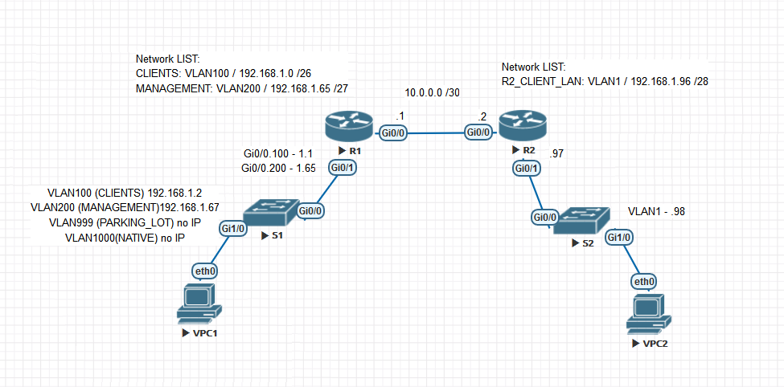

# Развертывание DHCPv4

###  Задание:
1. Построить сеть и произвести базовые настройки оборудования
2. Сконфигурировать DHCPv4 сервера для подсетей на R1
3. Сконфигурировать и проверить функционал DHCP relay на R2

###  Решение:
1. Графическая схема до начал работы, с нанесенной информацией о ионетфейсах и настраиваемых VLAN

### Этапы работы п.п.1
Расчет адресного пространства представлен ниже:
Таблица статических маршрутов.

| Device  | Interface | IP Address              | Subnet Mask                | default Gateway | Comment                        |
|-----|------|--------------------------|------------------------|---|--------------------------------------|
| R1  | Gi0/0 | 10.0.0.1                | 255.255.255.252            | 10.0.0.2 | IF to R2                         |
| R1  | IPv6 | ::/0                     | 20FF:CCFF:1000:19::1   | 1 | to R19 (ISP)                         |
| R5  | IPv4 | 0.0.0.0/0                | 172.16.17.1            | 1 | to R17 (ISP)                         |
| R5  | IPv6 | ::/0                     | 20FF:CCFF:1000:17::1   | 1 | to R17 (ISP)                         |
| R9  | IPv4 | 0.0.0.0/0                | 172.16.18.1            | 1 | to R18 (ISP)                         |
| R9  | IPv6 | ::/0                     | 20FF:CCFF:1000:18::1   | 1 | to R18 (ISP)                         |
| R13 | IPv4 | 0.0.0.0/0                | 172.16.20.1            | 1 | to R20 (ISP)                         |
| R13 | IPv6 | ::/0                     | 20FF:CCFF:1000:20::1   | 1 | to R20 (ISP)                         |
| R17 | IPv4 | 172.16.18.0/29           | 90.90.129.18/24        | 1 | to R18                               |
| R17 | IPv4 | 172.16.19.0/30           | 90.90.128.19/24        | 1 | to R19                               |
| R17 | IPv4 | 172.16.20.0/30           | 90.90.131.20/25        | 1 | to R20                               |
| R17 | IPv6 | 20FF:CCFF:1000:18::/64   | 20FF:CCFF:FFFF:2::18   | 1 | to R18                               |
| R17 | IPv6 | 20FF:CCFF:1000:19::/64   | 20FF:CCFF:FFFF:1::19   | 1 | to R19                               |
| R17 | IPv6 | 20FF:CCFF:1000:20::/64   | 20FF:CCFF:FFFF:5::20   | 1 | to R20                               |
| R18 | IPv4 | 172.16.17.0/30           | 90.90.129.17/24        | 1 | to R17                               |
| R18 | IPv4 | 172.16.19.0/30           | 90.90.131.130/25       | 1 | to R19                               |
| R18 | IPv4 | 172.16.20.0/30           | 90.90.130.20/25        | 1 | to R20                               |
| R18 | IPv6 | 20FF:CCFF:1000:17::/64   | 20FF:CCFF:FFFF:2::17   | 1 | to R17                               |
| R18 | IPv6 | 20FF:CCFF:1000:19::/64   | 20FF:CCFF:FFFF:6::19   | 1 | to R19                               |
| R18 | IPv6 | 20FF:CCFF:1000:20::/64   | 20FF:CCFF:FFFF:3::20   | 1 | to R20                               |
| R19 | IPv4 | 172.16.17.0/30           | 90.90.128.17/24        | 1 | to R17                               |
| R19 | IPv4 | 172.16.18.0/29           | 90.90.131.129/25       | 1 | to R18                               |
| R19 | IPv4 | 172.16.20.0/30           | 90.90.130.130/25       | 1 | to R20                               |
| R19 | IPv6 | 20FF:CCFF:1000:17::/64   | 20FF:CCFF:FFFF:1::17   | 1 | to R17                               |
| R19 | IPv6 | 20FF:CCFF:1000:18::/64   | 20FF:CCFF:FFFF:6::18   | 1 | to R18                               |
| R19 | IPv6 | 20FF:CCFF:1000:20::/64   | 20FF:CCFF:FFFF:4::20   | 1 | to R20                               |
| R20 | IPv4 | 172.16.17.0/30           | 90.90.131.17/25        | 1 | to R17                               |
| R20 | IPv4 | 172.16.18.0/29           | 90.90.130.18/25        | 1 | to R18                               |
| R20 | IPv4 | 172.16.19.0/30           | 90.90.130.129/25       | 1 | to R19                               |
| R20 | IPv6 | 20FF:CCFF:1000:17::/64   | 20FF:CCFF:FFFF:5::17   | 1 | to R17                               |
| R20 | IPv6 | 20FF:CCFF:1000:18::/64   | 20FF:CCFF:FFFF:3::18   | 1 | to R18                               |
| R20 | IPv6 | 20FF:CCFF:1000:19::/64   | 20FF:CCFF:FFFF:4::19   | 1 | to R19                               |
```
show команды демонстрации результатов
```
Результат выводов
```
S1#show spanning-tree
```
Объяснение результатов
Из вывода команды, видно, что по-умолчанию ....

Базовые настройки оборудования представлены по ссылкам [S1](config/S1), [S2](config/S2), [S3](config/S3).

2. Этап. Настройка ... 
После того как было настроено....
### Просмотр состояния на узле...
```
X# show ...
```
Демонстрация вывода команды представлена ниже...
```
.....
```
На основании представленной информации можно сделать вывод, что ....

### Ответы на вопросы Л/р:
- ...
- ...

Вторая часть задания состоит настройке .... Иллюстрация к второй части задания представлена ниже. 


1. Изменение стоимости порта
Изменена стоимость порта Gi0/3 на S2. Включив debug span event, мы видим следующие результаты:
```
### S2
....
```
Из дебага можно понять, что 

Иллюстрация к изменившейся топологии приведена ниже:

Ответом на вопрос задания является то, что ...

4. После удаления стоимости порта, видим обратную картину, порты вернулись в предварительное состояние
```
...
```
дебаг процесса представлен ниже
```
...
```

5. Включим все порты на S1, S2, S3. После прохождения 30 секунд топология будет соответствовать иллюстрации

Ответы на вопросы:
- На каждом не корневом           
